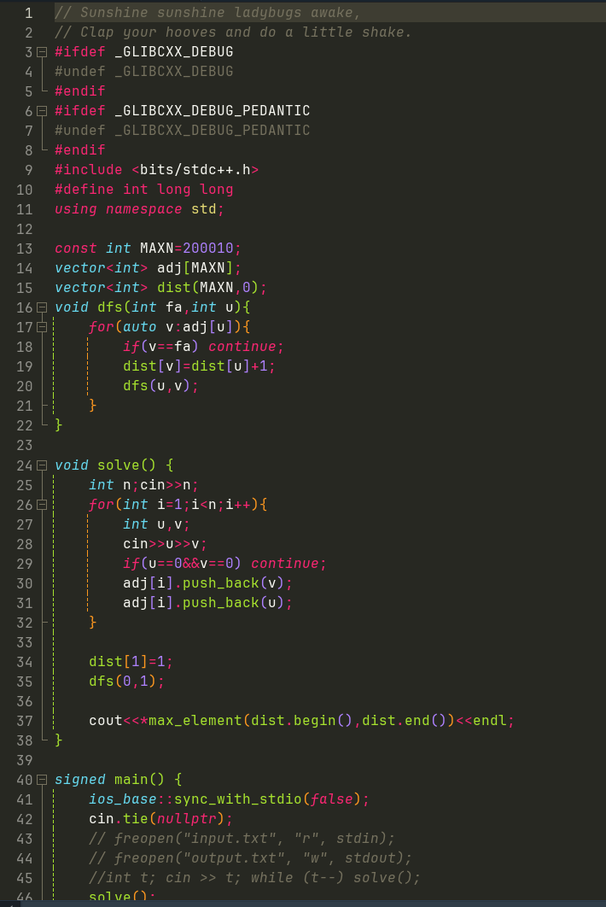

# Dev-C++ Sublime Theme

为 Dev-C++ 精心调配的 Sublime Text 风格暗色主题配置。
提供舒适的视觉体验，非常适合长时间编写代码以及在 Codeforces、牛客等平台刷题打比赛时使用。

## 📸 预览 (Screenshot)

## ✨ 特性 (Features)

* **Sublime 经典配色**：还原 Sublime Text 经典的暗色语法高亮，色彩鲜明且对比度适中。
* **护眼体验**：告别 Dev-C++ 默认的刺眼纯白背景，有效降低长时间盯屏幕带来的视觉疲劳。
* **专注 C/C++**：针对算法竞赛中常用的 C/C++ 语法特性，专门优化了关键字、函数、宏定义与注释的色彩搭配。

## 🚀 安装指南 (Installation)

1. 下载本仓库中的 `SublimeMonokai.scheme` 文件。
   *(提示：点击文件进入后，点击右上角的 `Download raw file` ⬇️ 按钮即可下载)*
2. 打开 Dev-C++ 软件。
3. 在顶部菜单栏依次点击：`工具 (Tools)` -> `编辑器选项 (Editor Options)` -> `语法高亮 / 颜色 (Colors)`。
4. 点击下方的 `导入 (Import)` 按钮，在弹出的窗口中选择你刚刚下载的 `SublimeMonokai.scheme` 文件。
5. 导入成功后，在预设主题（Preset）下拉菜单中选择该主题，点击 `确定 (OK)` 即可应用。

## 📝 反馈 (Feedback)

如果在使用过程中发现某些特殊语法的高亮不够完美，欢迎提交 Issue 或者 Pull Request 共同改进。

## 📄 协议 (License)

[MIT License](LICENSE)
